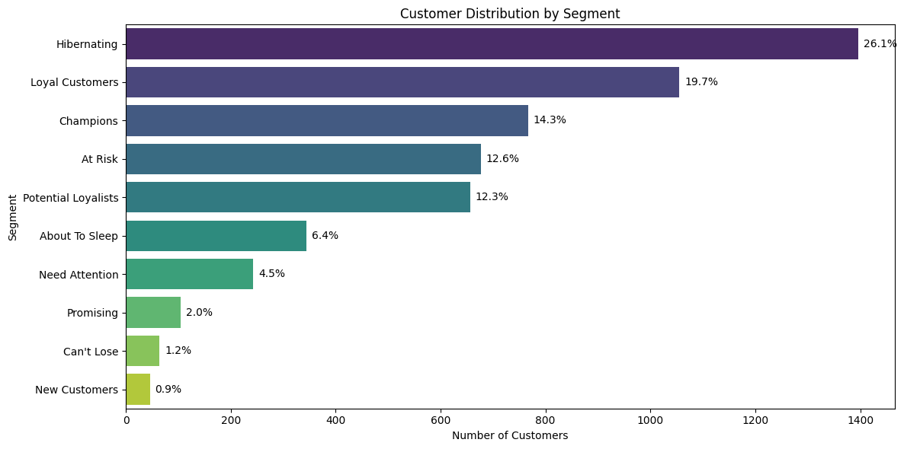

# Customer Segmentation & RFM Analysis

## Project Overview
In the competitive e-commerce landscape, treating all customers the same leads to wasted marketing budget. This project analyses over 1 million transactions from a UK-based online retailer to identify distinct customer segments using RFM (Recency, Frequency, Monetary) Analysis.

## Business Goal
To transform raw transaction data into actionable customer segments, allowing the marketing team to target specific groups (e.g., "Hibernating" vs. "Champions") with personalised retention strategies.

## The Analysis Workflow
This project follows a structured data analytics pipeline:

### 1. Data Cleaning & EDA
* Outlier Detection: Identified and removed extreme outliers (Quantity > 60,000) caused by cancelled bulk orders.
* Data Integrity: Removed transactions with missing Customer IDs (22% of data) and filtered for the primary market (UK).
* Deduplication: Removed duplicate records to ensure accurate frequency counts.

### 2. The RFM Engine
* Recency: Calculated days since last purchase (referenced against a snapshot date).
* Frequency: Counted unique invoices per customer.
* Monetary: Summed total spend per customer.
* Scoring: Applied pd.qcut() to bin customers into scores from 1-5.

### 3. Customer Segmentation
Using the RFM scores, customers were mapped to 10 distinct segments based on their purchasing behaviour.

* Largest Segment: Hibernating (26.1%) - Customers who purchased long ago and haven't returned.
* High Value: Champions (14.3%) - Recent, frequent, and high-spending shoppers.
* Retention Risk: At Risk (12.6%) - Frequent shoppers who haven't purchased recently.

## Visualisation

## Business Recommendations
1. Wake Up the "Hibernating" (26.1%): Since this is the largest segment, a low-cost re-engagement campaign (email/SMS) is critical to reduce churn.
2. Protect the "Champions" (14.3%): These users drive the most revenue. Implement a VIP loyalty tier to lock them in.
3. Save the "At Risk" (12.6%): These were once loyal. Investigate why they stopped (price? service?) and offer targeted win-back incentives.

## Tech Stack
* Python: Data manipulation and logic.
* Pandas: Aggregation, cleaning, and RFM calculation.
* Seaborn/Matplotlib: Data visualisation.

* Created by Wong Jung Yong *
